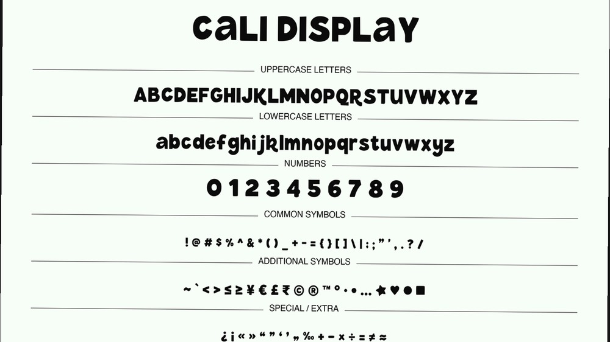
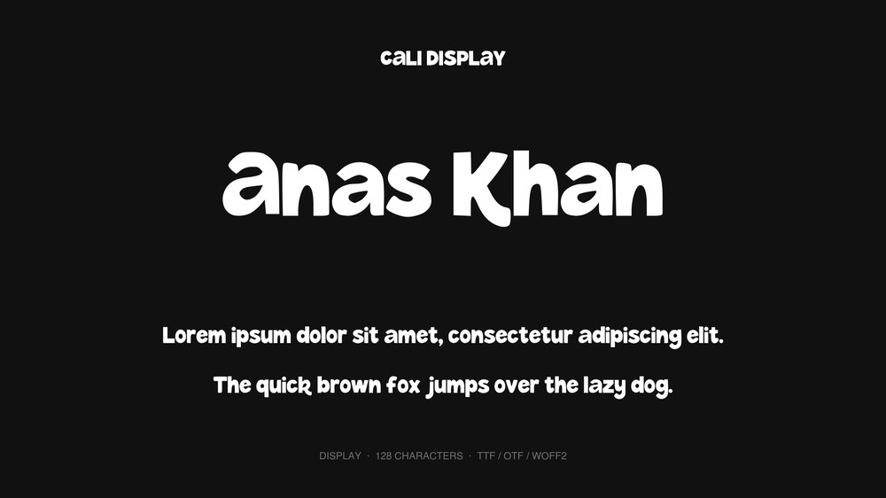
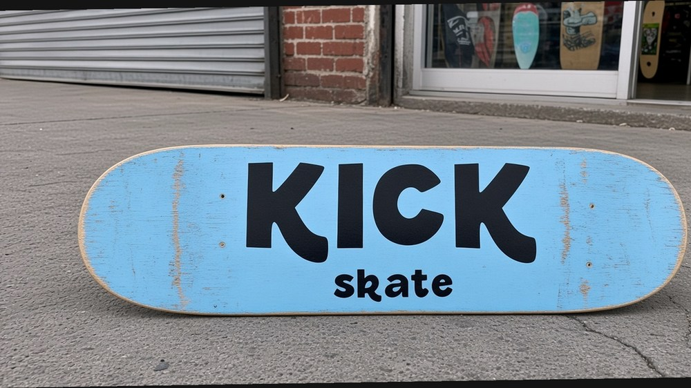
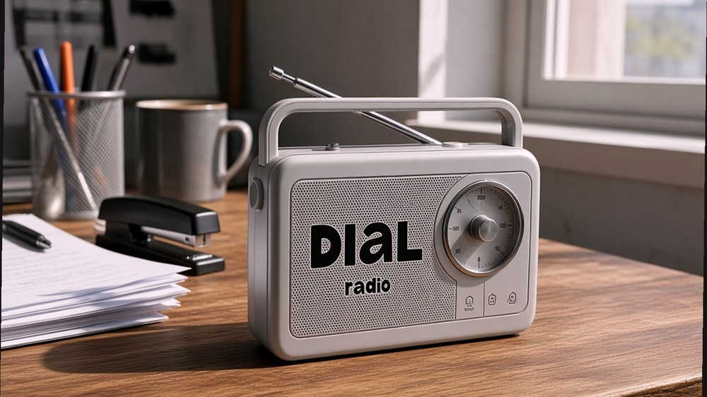
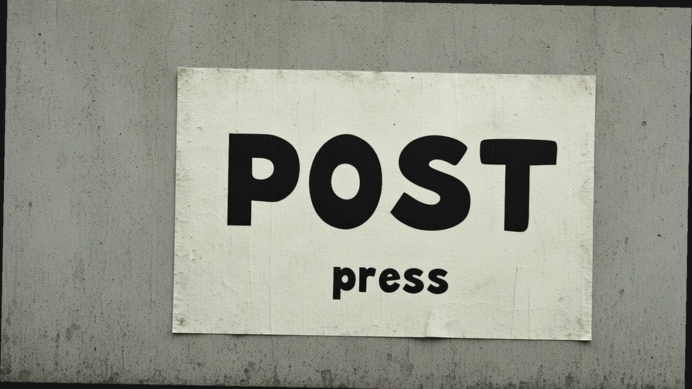
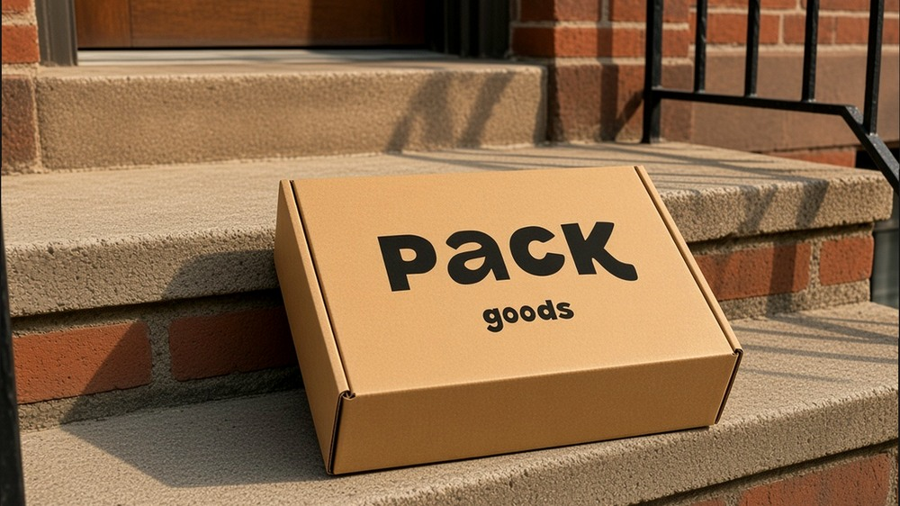
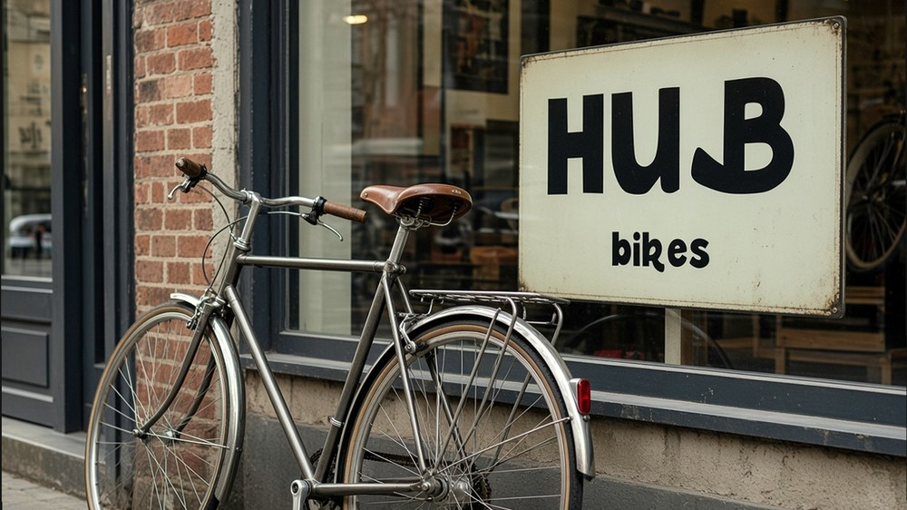

# Cali Display

A heavy display face with irregular, rounded letterforms.

**Demo:** [anxkhn.github.io/cali-display](https://anxkhn.github.io/cali-display/)

<p align="center">
  
</p>

[Fonts](fonts/) · [SIL OFL](OFL.txt)

---

## Demo images

<p align="center">
  
</p>

<p align="center">
  
</p>

<p align="center">
  
</p>

<p align="center">
  
</p>

<p align="center">
  
</p>

<p align="center">
  
</p>

<p align="center">
  
</p>

<p align="center">
  
</p>

<p align="center">
  
</p>

<p align="center">
  
</p>

<p align="center">
  
</p>

<p align="center">
  
</p>

---

## Install

Double-click [`fonts/CaliDisplay-Regular.ttf`](fonts/CaliDisplay-Regular.ttf) and install it in Font Book. On Windows, right-click the TTF and choose Install. Pick **Cali Display**.

| File | Use |
| --- | --- |
| [`CaliDisplay-Regular.ttf`](fonts/CaliDisplay-Regular.ttf) | Desktop |
| [`CaliDisplay-Regular.otf`](fonts/CaliDisplay-Regular.otf) | Desktop |
| [`CaliDisplay-Regular.woff2`](fonts/CaliDisplay-Regular.woff2) | Web |

128 characters. Separate upper and lowercase. `ss01` selects the single-storey A and swashed B.

---

## Use it on a site

```css
@font-face {
  font-family: "Cali Display";
  src: url("https://raw.githubusercontent.com/anxkhn/cali-display/main/fonts/CaliDisplay-Regular.woff2")
    format("woff2");
  font-weight: 900;
  font-style: normal;
  font-display: swap;
}

.headline {
  font-family: "Cali Display", sans-serif;
  font-weight: 900;
}
```

jsDelivr:

```text
https://cdn.jsdelivr.net/gh/anxkhn/cali-display@main/fonts/CaliDisplay-Regular.woff2
```

Type in it at [anxkhn.github.io/cali-display](https://anxkhn.github.io/cali-display/).

---

## License

[SIL Open Font License 1.1](OFL.txt). Use it, embed it, ship it. Do not sell the font files by themselves. Reserved name: **Cali Display**.
